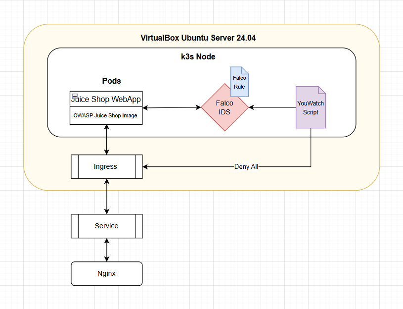
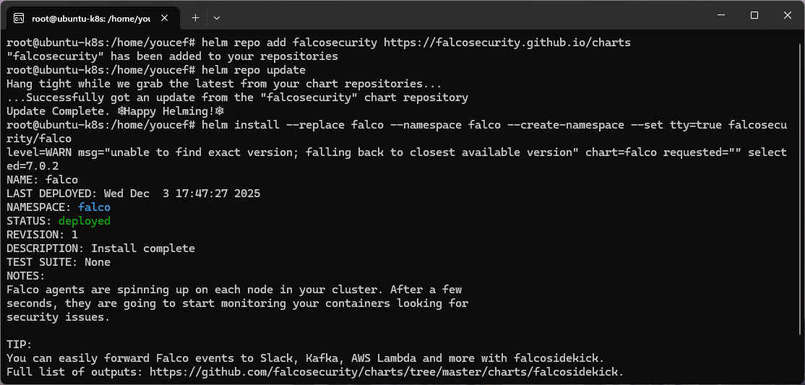
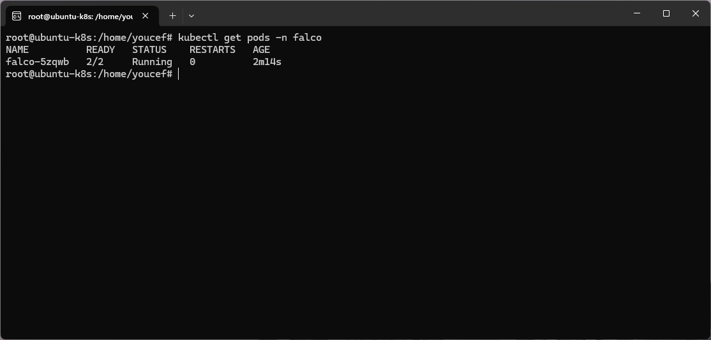
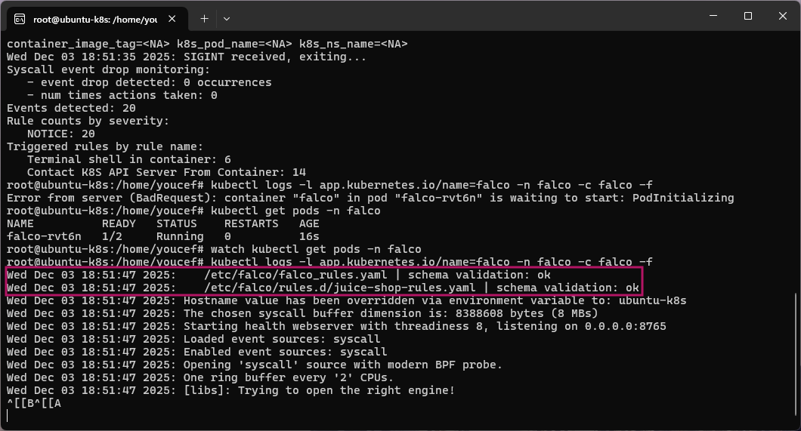
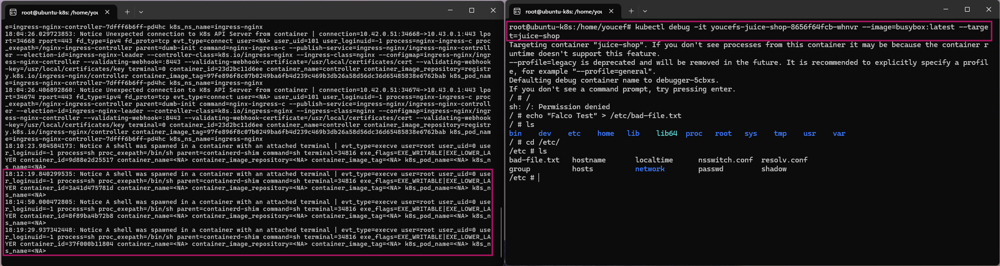
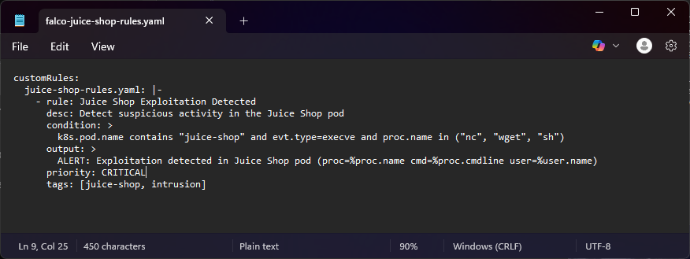
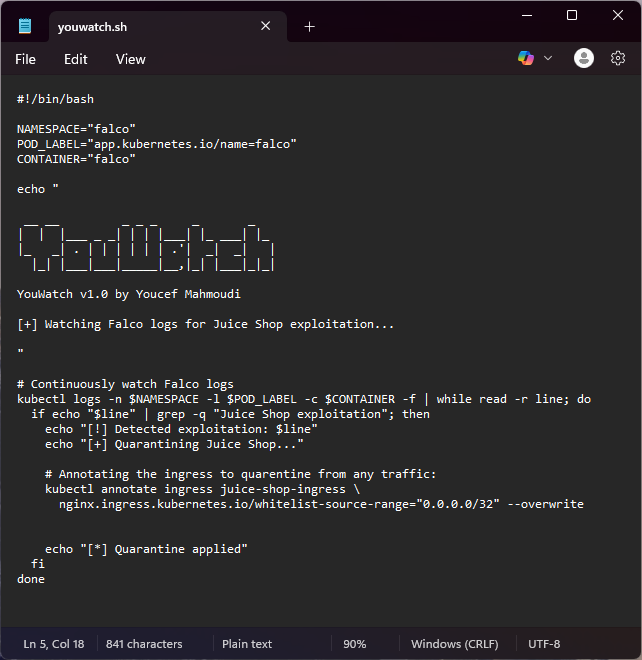
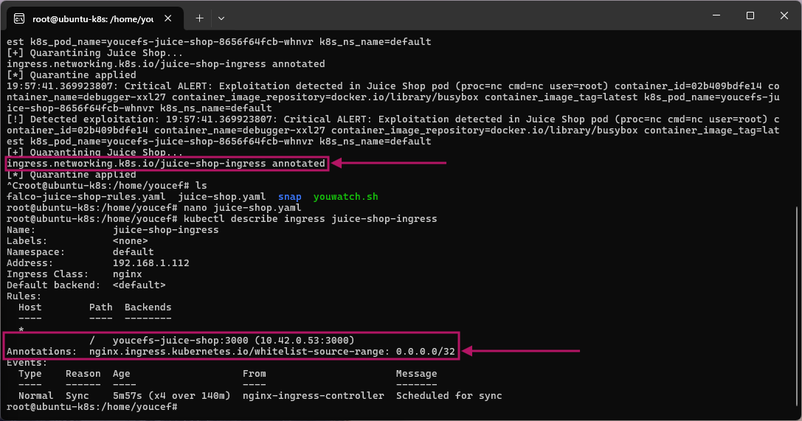
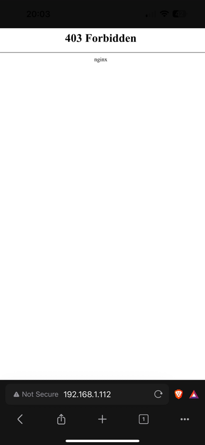
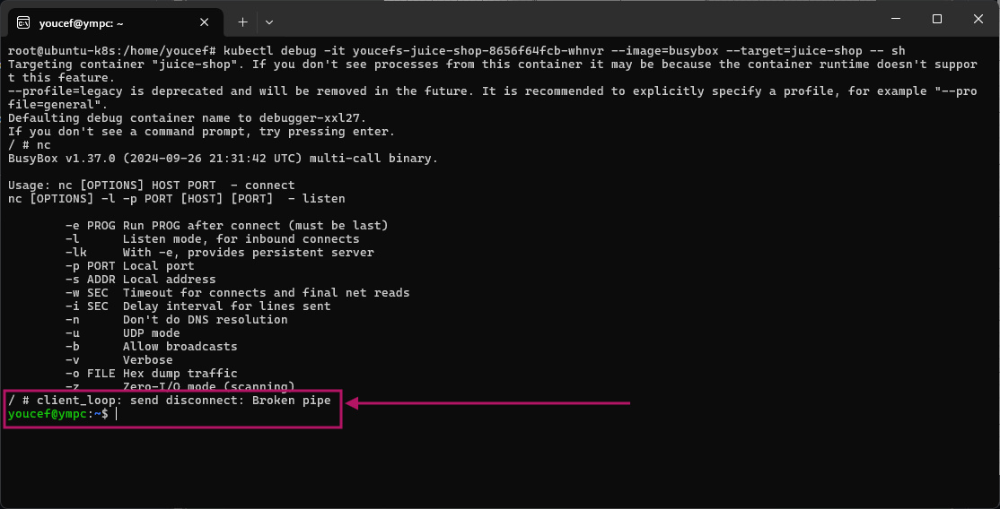

# Falco Auto-Quarantine System
## Automated Runtime Threat Detection and Ingress Isolation for Kubernetes
This project demonstrates a full workflow for implementing runtime threat detection with Falco, injecting custom Falco rules for targeted monitoring, and automating real-time quarantine of a vulnerable web application when suspicious activity is detected. The system is deployed on a k3s cluster running on Ubuntu 24.04 inside VirtualBox.

### Prerequisites
This project builds on the Nginx Zero-Trust Access *(ZTNA)* implementation I developed previously. That project provides the VirtualBox configuration, SSHing into the VM, the Nginx ingress gateway, client authentication workflow and secure routing foundation used here. The existing Nginx configuration and certificates were reused to expose the new workload and test the YouWatch quarantine flow.

## Project Overview

The goal of the project is to create a minimal IDS-driven response pipeline:

1. Falco detects suspicious runtime activity in a Kubernetes workload.

2. A Bash automation script *(YouWatch)* listens to Falco logs.

3. When a detection occurs, the YouWatch automatically quarantines the affected application by modifying Kubernetes Ingress rules.

This forms the basis of a Kubernetes auto-isolation mechanism similar to workload IPS behavior.

### Stack Used
* **Operating System:** Ubuntu Server 24.04 LTS *(inside VirtualBox)* 
* **Networking:** Bridged Adapter *(we're using LAN connectivity)*
* **Container Orchestration:** K3s *(lightweight Kubernetes distribution)*
* **Security:** Nginx Ingress Controller *(for IP Whitelisting)*, Falco IDS, YouWatch *(youwatch.sh)*
* **Target:** OWASP Juice Shop Pod

### Data Flow
This flow chart builds upon the previous web application deployment that uses an Nginx ingress controller.

---

## Part 1: Environment Setup

### 1. Installing and Configuring Falco
Falco was installed using Helm, following the official Kubernetes quickstart guide:

https://falco.org/docs/getting-started/falco-kubernetes-quickstart/

Falco was deployed to the dedicated `falco` namespace as a DaemonSet, enabling full syscall-level visibility across the cluster. 

Running `kubectl get pods -n falco` or `watch kubectl get pods -n falco` confirms the Falco pods are running:

### 2. The Initial Falco Rule
A custom rule file `falco-juice-shop-rules.yaml` was created to detect suspicious processes inside the OWASP Juice Shop pod. It was injected through Helm values so that Falco would merge it with its default ruleset:

### 3. Deploying the Falco Rule
The YAML was transferred to my Ubuntu VM environment and applied. After applying the ConfigMap, the Falco DaemonSet was restarted to ensure the new ruleset loaded correctly:

### 4. Streaming Falco Logs via the Rule
I then streamed the Falco logs in real-time with `kubectl logs -l app.kubernetes.io/name=falco -n falco -c falco -f`:

#### Issues Encountered

I thought everything was applied correctly. However, when sh-ing into my Juice Shop pod, no alerts were triggered. The default ruleset Falco uses was working though:

I then realised my YAML was wrong. I used an ephemeral debugging container to access my Juice Shop pod. Ephemeral debugging containers do not inherit the original workload container name. They run isolated but share namespaces, so Falco sees them but does not classify them as the application container.

This caused the custom rule to never trigger.

#### Corrected YAML
The correct selector was `k8s.pod.name contains "juice-shop" .....` as opposed to the initial selector `container.name = "youcefs-juice-shop" ......`. I re-transferred the updated YAML and applied it:

After applying the rule, when spawning a shell inside of my Juice Shop pod, the custom alert triggers:

---

## Part 2: YouWatch
### 1. YouWatch: The Automated Quarantine Script
I created a Bash script called YouWatch:

The script streams Falco logs with the -f flag and while reading the line, checks to see if a Juice Shop alert has been triggered by Falco. If it detects this log, YouWatch will automatically apply a "deny all ingress" overwrite to the existing Nginx ingress resource. 

#### Issues Encountered
When I ran the script, nothing was showing up. The Falco logs were triggering, but YouWatch wasn't doing anything:

I then looked again at my code, and realised the `grep` command wasn't correct - it didn't match the updated Falco rule output. I adjusted the filters and log stream command within the Bash script, as well as the order which the command was run to mimic the grep command I had used previously to verify if the Falco logs were streaming properly:

### 2. YouWatch In Action
After adjusting the filters and log stream command, YouWatch *(v1.1)* successfully intercepted the alerts and applied quarantine logic:

### 3. Quarantine In Action From YouWatch

When running the command `kubectl describe ingress juice-shop-ingress`, the output under the 'Annotations' section shows `whitelist-source-range` annotation with `0.0.0.0/32` - 0.0.0.0 means no IP is allowed to ingress and /32 just indicates a single IP

This was because the YouWatch script overwrote the ingress Juice Shop to segment it properly. 

If you are familiar with my previous project, I deployed this web server using the same Nginx controller and VM environment. One of the outcomes was that my iPhone *(192.168.1.74 on LAN)* was whitelisted and could access the web application on *(http://)* 192.168.1.112. However, when YouWatch quarantined the pod by applying this overwrite, I am no longer able to access the web application:

 

Furthermore, I am immediately kicked out of the shell inside the pod, which is what triggered the Falco rule in the first place:

This confirmed that the auto-response pipeline:

Falco Alert --> Log Stream --> YouWatch --> Detection --> Ingress Rewrite --> Service Isolation

...was fully functional.

## Lessons Learned
### Falco Advantages
Falco is highly effective for detecting:

- Suspicious processes inside containers
- Reverse shells
- Unexpected syscalls
- File tampering
- Unauthorized shell spawns
- Outbound connections to unknown hosts

This makes Falco an excellent runtime security and intrusion detection tool at the syscall level.

### Falco Disadvantages
Falco cannot detect:

- Web-layer attacks (SQL injection, XSS, command injection payloads)
- Malicious HTTP requests
- Nginx or application-layer exploit patterns
- OWASP Juice Shop vulnerabilities

Because Falco observes syscalls, not HTTP traffic, it cannot inspect user requests entering the Nginx ingress or the web server itself.

### Considerations for Future Projects
The Falco Auto-Quarantine System provides a working proof-of-concept for:

- Runtime threat detection via syscall inspection
- Custom Falco rule integration
- Automated incident response through Kubernetes Ingress manipulation
- Seamless isolation of compromised workloads

This project has many use cases. Initially, it was supposed to streamline these parts of the typical Incident Response Plan:

- Detection
- Analysis
- Containment

*(In the overall picture - Preparation, Detection, Analysis, Containment, Eradication, Recovery, Lessons Learned)*. If this was extrapolated further, I believe YouWatch has the capability to address more of those pillars.

While Falco cannot detect application-layer exploits, this project establishes the foundation for a future hybrid IDS/WAF system capable of full lifecycle protection.

