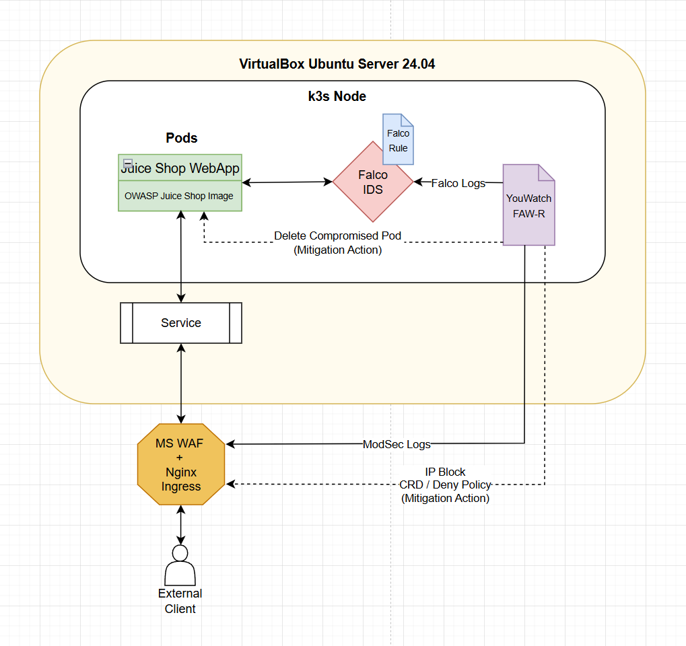
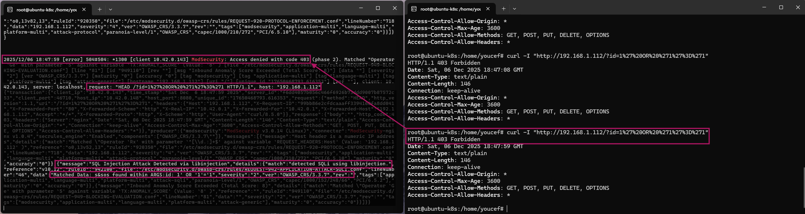
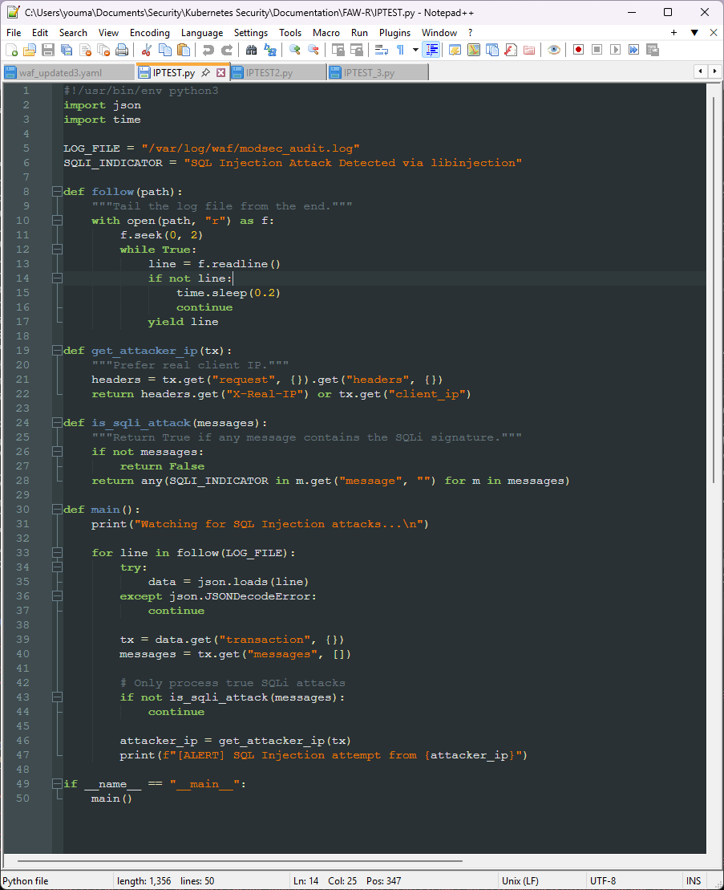
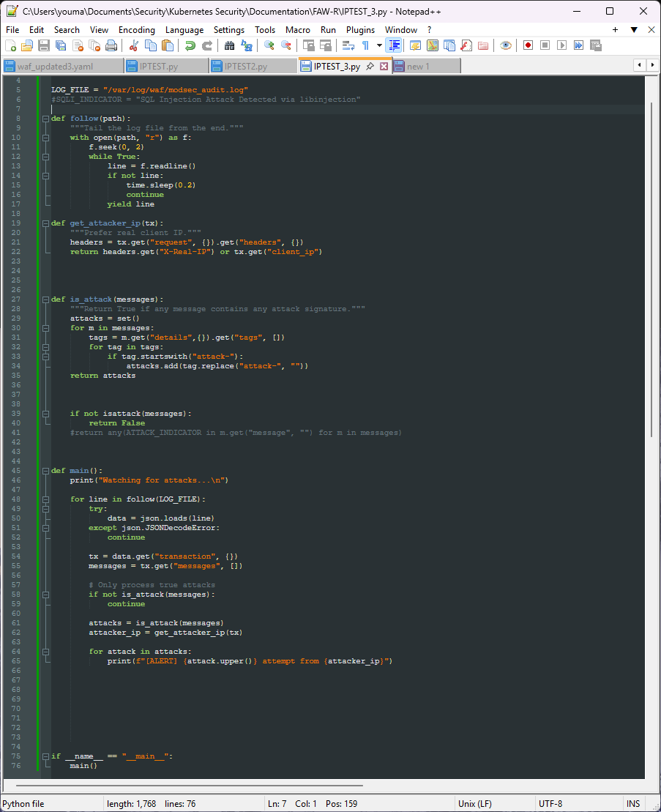
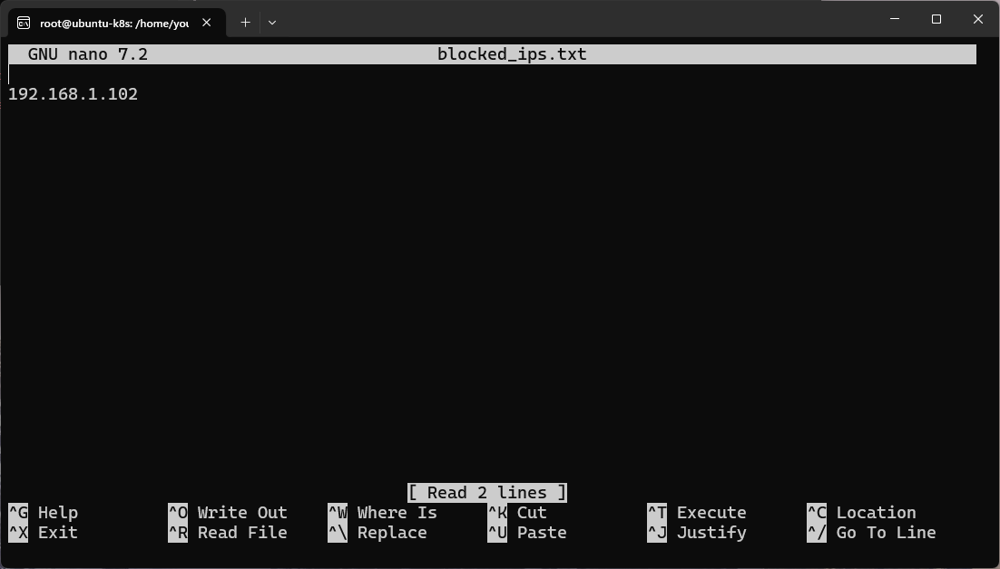
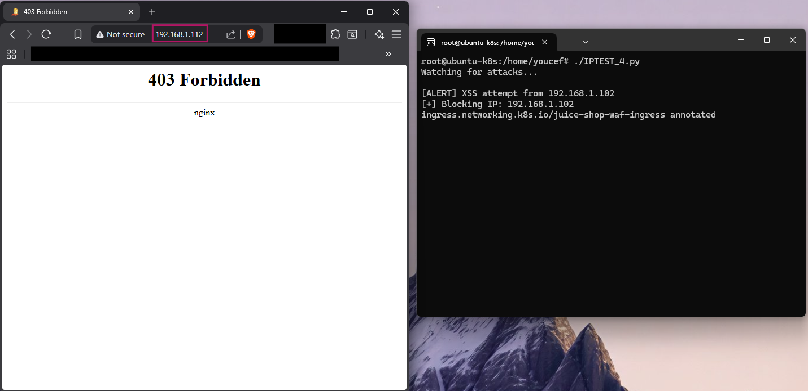
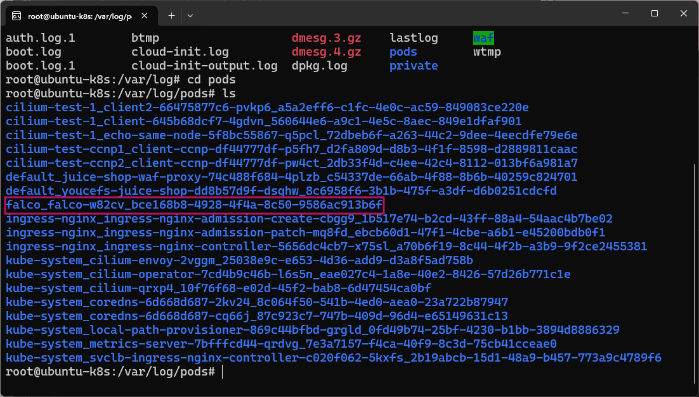
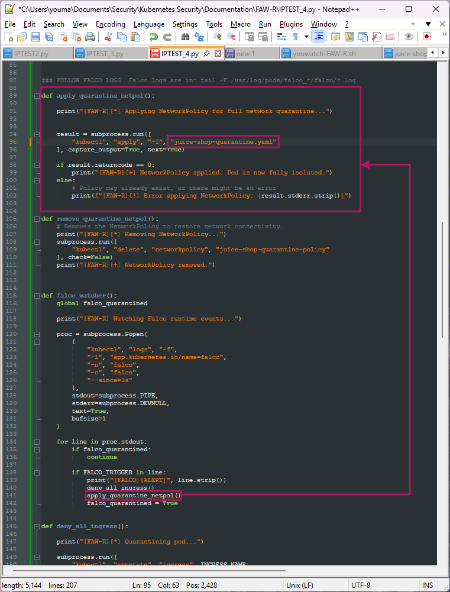
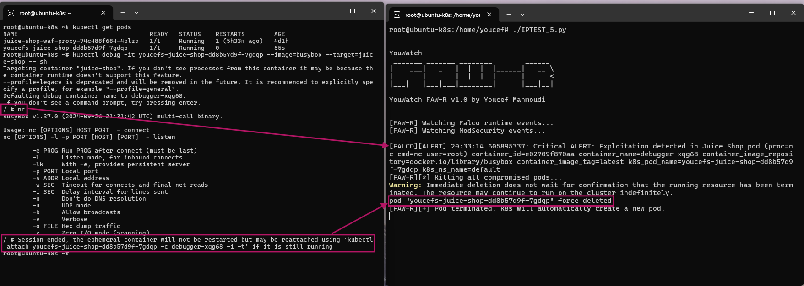

# YouWatch FAW-R: A Multi-Layered Security Response Engine for Kubernetes

## Project Overview
YouWatch FAW-R is the next-generation automated threat mitigation system designed for Kubernetes. Building upon the successful principles of the YouWatch Auto-Quarantine system, FAW-R *(Falco + WAF Reactor)* unifies threat intelligence from both Runtime Detection *(via Falco)* and Application Layer Defence *(via WAFs like ModSecurity)* to provide a dynamic and instantaneous response capability.

### Prerequisites
FAW-R builds upon the environment established in the YouWatch Falco AQS project, which details the Nginx ingress and Falco installation with the specific Falco rule applied to monitor specific pods. The Python script for FAW-R references those resources, so if you wish to test FAW-R out for yourself you will need to correlate the variables in the code to your own cluster environment.

**Threat coverage**
FAW-R complements the Core Rule Set (CRS) of the ModSecurity WAF by coverting detection into immediate response. Therefore, coverage includes:

- SQL Injection (SQLi)
- Cross-Site Scripting (XSS)
- Command Injection and OS Command Execution
- Local and Remote File Inclusion (LFI / RFI)
- Path Traversal
- XML External Entity (XXE)
- Server-Side Request Forgery (SSRF)
- HTTP Protocol Abuse and Request Smuggling
- Authentication and Session Attacks
- Automated Scanning and Reconnaissance
- Other runtime exploitation attempts

**Automated responses**
- Per-IP blocking at the ingress layer
- Runtime exploit detection
- Compromised pod termination and automatic recovery

In modern Kubernetes deployments, a single defence layer is insufficient. YouWatch FAW-R bridges that gap. YouWatch FAW-R has deep kernel visibility and front-end application security, allowing for rapid quarantine of malicious activity at the earliest point of detection. FAW-R prevents the full spectrum of OWASP Top 10 and beyond. It doesn't block traffic blindly. It transforms WAF detections into automated, live containment actions.

When combined with Falco, external attacks are stopped at the ingress. Internal exploitation triggers pod termination and the attack chain is broken at multiple layers. This positions FAW-R as a WAF, an Automated Incident Response Engine and a Runtime Security Orchestrator all-in-one.

---

## Stack Used
* **VirtualBox VM:** *(192.168.1.112 on LAN)*
  * **Operating System:** Ubuntu Server 24.04 LTS *(inside VirtualBox)* 
* **Networking:** Bridged Adapter *(LAN connectivity)*
* **Container Orchestration:** K3s *(lightweight Kubernetes distribution)*
* **Security:** Nginx Ingress Controller *(for IP Whitelisting)*, Falco IDS, ModSecurity WAF, YouWatch FAW-R *(Youwatch FAW-R.py)*
* **Attacker Machine:** My PC running Windows 11 Home *(192.168.1.102 on LAN)*
* **Target:** OWASP Juice Shop Pod *(intentionally vulnerable)*

### Data Flow
The FAW-R architecture will center around a central response daemon that monitors inputs and executes mitigation steps:

* **Inputs:** Falco and WAF log outputs
* **Logic:** The FAW-R engine correlates events and applies pre-defined response playbooks.
* **Outputs:** The mitigation. Kubernetes API calls to update Nginx Ingress rules based on the attacker IP. Complete deletion of compromised pod based on the custom Falco ruleset in the YouWatch Falco Auto-Quarantine Project. This ensures both external attack prevention and internal compromise containment.

---
## Part 1: ModSecurity WAF Deployment with Accessible Logs
The first design decision was to use ModSecurity with the OWASP Core Rule Set as the web application firewall. ModSecurity was chosen because it provides transparent inspection of HTTP traffic and produces structured audit logs that are relevant for FAW-R to analyse automatically.

Rather than relying on in-container logs, audit logs were mounted to the host filesystem. This ensured log persistence, simplified monitoring, and avoided losing forensic data if the WAF pod was restarted or replaced.

 

At this stage, the primary challenge was ensuring that ModSecurity was actually enforcing rules, as well as confirming audit logs were written in JSON format and accessible from outside the container. Once verified, the WAF reliably blocked malicious requests while still allowing legitimate traffic.

---

## Part 2: Building the WAF Response Engine
With logs accessible, the next step was to build a lightweight response engine capable of understanding ModSecurity output. At this stage, SQLi was specifically monitored to test the capability of detection:

 

Rather than keying off individual rule IDs *(which vary between CRS versions)*, the script inspects semantic tags attached to each alert. Tags beginning with `attack-*` represent meaningful security violations, while tags such as attack-protocol and attack-generic often represent low-signal noise. 

Before the attack filtering:

 

 

After attack filtering:

 

This filtering approach dramatically reduced false positives while still detecting real attacks such as SQL injection and XSS.

---

## Part 3: Automated Containment via Ingress Controls
Once attacks could be reliably identified, the next goal was automated containment.

Rather than modifying firewall rules or restarting services, Kubernetes ingress annotations were used to dynamically inject NGINX deny rules. This approach allowed malicious clients to be blocked immediately at the edge without affecting legitimate users.

 

Each attacking IP is appended to a deny list, ensuring repeated attempts are blocked consistently without log spam or manual intervention.

This method was chosen because it's fast, reversible *(just re-apply the ingress.yaml with `kubectl apply -f ingress.yaml`)* and it aligns with Kubernetes-native configuration patterns.

 

---

## Part 4: Runtime Detection with Falco
While a WAF is effective against external threats, it cannot detect what happens after an attacker gains access. Falco was introduced in the YouWatch Auto-Quarantine Project to monitor runtime behavior within the cluster. Custom Falco rules were created to detect exploitation attempts targeting the Juice Shop pod specifically.

Rather than reimplementing Falco log parsing logic, the system follows the same pattern as the working YouWatch Bash script workflow previously: streaming Falco logs directly via `kubectl logs -f` via this location:

When a Falco alert containing the trigger string is detected, the system treats the pod as compromised.

---

## Part 5: Quarantine Strategy and Final Design Choice

I attempted to create a separate network policy and enforce that ingress in the program:

 

I then realised that once a pod is compromised, ingress is **irrelevant**. Ingress can prevent entry - it cannot evict a compromised pod. 

Ingress only restricts traffic at the HTTP layer and does not remove malicious in-memory states. So instead, I decided to delete the current web app pod in use, which would drop attacker shells inside it, kill reverse shells, create a new clean pod and neutralise the threat.

In Kubernetes, pods are ephemeral by design. Deleting a compromised pod ensures any active shells or malware are immediately terminated and a clean replacement pod is automatically created. This aligns with modern cloud incident response practices and avoids risky 'on-the-spot' remediation.

---

## Part 6: YouWatch FAW-R In Action

YouWatch FAW-R operates continuously and requires no human interaction once deployed:

My program detects web attacks in real time, blocks attackers automatically, detects runtime exploitation attempts, removes compromised workloads and restores service without manual intervention.

---

### Issues Encountered
Throughout the development of YouWatch FAW-R, several technical and design challenges were encountered. Each issue directly influenced the final architecture and helped refine the incident response strategy.

| Issue | Fix |
| :--- | :--- |
| **ModSecurity running but not enforcing** | Explicitly enabling the rule engine and validating enforcement through controlled SQLi and XSS tests. |
| **Audit logs not persisting across pod restarts** | Mounting the audit log directory to the host ensured persistence and allowed external monitoring by the response engine. |
| **False positive from Generic and Protocol tags** | Filtering out `attack-generic` and `attack-protocol` tags and instead focusing on semantic `attack-*` classifications representing real threats. |
| **Ingress rules applying but traffic still allowed** | Ensuring deny rules were evaluated before allow rules in the injected NGINX server snippet. |
| **Falco logs not detectable from filesystem** | Streaming logs via `kubectl logs -f` provided consistent, real-time visibility. |
| **Falco alerts visible live but missing from log history** | This behavior was traced to Falco’s `stdout`-based logging and rotation, reinforcing the need for real-time log consumption rather than post-event analysis. |
| **Quarantining via Ingress insufficient for runtime compromise** | Blocking HTTP traffic alone did not remove attackers who had already achieved code execution inside the pod. This highlighted a key limitation of network-only containment. |
| **Network policies ineffective for active exploitation** | Initial attempts to isolate compromised pods using Kubernetes NetworkPolicies did not terminate active sessions or malicious processes. This led to the adoption of a stronger remediation strategy *(pod deletion)*. |

---

### Real World Applications of YouWatch FAW-R

Essentially, FAW-R acts as a mini SOAR pipeline, without a formal SOAR platform: 

**Event --> Classification --> Decision --> Automated Action**

Many Incident Response teams fail because they start building tooling during an incident. FAW-R is always on. This means FAW-R complements these aspects of a typical IR plan...

* Preparation *(Pre-deployed controls and automation)*
* Detection *(WAF + Falco runtime detection)*
* Containment *(IP blocking + pod deletion)*
* Eradication *(**Partial:** Cloud-native immutability)*
* Recovery *(K8s pod recreation)*

...in the wider picture of Preparation, Detection, Analysis, Containment, Eradication, Recovery, Lessons Learned. 

YouWatch FAW-R also complements:

- Detection engineering *(high-signal detection logic, avoiding alert fatigue, CRS rule abstration)*
- Cloud security *(k8s response patterns, immutable infrastructure principles, self healing systems)*
- Threat modelling *(modelled external attacker paths, runtime breakout scenarios, blast radius reduction)*

 

