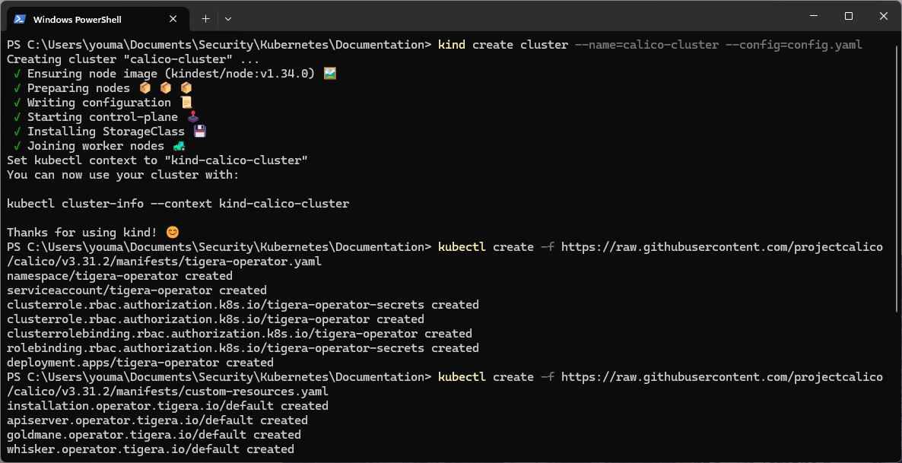

# Kubernetes Security Automation: Zero-Trust & Network Policy Enforcement

## Project Overview
This project demonstrates the implementation of Zero-Trust Network Segmentation and Automated Security Controls within a Kubernetes environment. Using Kind (Kubernetes in Docker) and Calico, I deployed a Vulnerable Web Application (OWASP Juice Shop) to test and enforce strict ingress traffic policies.

### Key Technologies Used
- Kubernetes *(Kind)*
- Calico CNI
- Calico Whisker *(Observability)*
- Trivy *(Vulnerability Scanning)*

---

## Part 1: Basic Ingress Traffic Blocking

### 1. Cluster Setup & Calico Deployment
I began by installing Kind and configuring the cluster to use Calico as the Container Network Interface *(CNI)*. The configuration ensures the Calico control plane and worker nodes are correctly deployed with the necessary Custom Resource Definitions *(CRDs)* for policy enforcement.

Verifying the Calico components using the Tigera operator:

### 2. Monitoring with Calico Whisker
To visualise network traffic flows in real-time, I utilised Calico Whisker. I set up port forwarding to access the Whisker UI via the browser, allowing me to monitor allowed and denied traffic decisions.

### 3. Deploying the Vulnerable Web App
I deployed the OWASP Juice Shop as a target application.

After deployment, I verified connectivity using a `busybox` container. As expected, the connection was initially successful.

### 4. Enforcing a Default-Deny Policy
To secure the application, I created a Calico NetworkPolicy to log and block all ingress traffic to the web application by default.

Applying the policy to the cluster:

---

## Part 2: Zero-Trust Policies & Vulnerability Scanning

### 1. Implementing Zero-Trust Segmentation
Next, I demonstrated a Zero-Trust model by creating an exception. I configured a specific policy to allow traffic only from a trusted pod named `youcef`, while keeping all other traffic blocked.

I achieved this by assigning a higher priority (lower order number) to the allow rule:

Applying the Zero-Trust exception rule:

### 2. Policy Enforcement in Action
**Unauthorised Access Attempt:**
Traffic from any standard pod *(not matching the `youcef` label)* is denied and logged by Whisker.

**Authorised Access:**
When connecting from the trusted `youcef` pod, the traffic is allowed, successfully demonstrating precise microsegmentation.

### 3. Vulnerability Scanning with Trivy
Finally, I performed a container security scan on the `juice-shop` image using Trivy.

**Scan Results:**
The scan revealed significant vulnerabilities in the outdated image:
* **Total:** 68 Vulnerabilities *(including 8 CRITICAL)*
* **Debian Image:** 12 Low
* **Node.js Packages:** 55 Vulnerabilities

#### Critical Vulnerabilities Identified

| CVE ID | Package | Issue | Fix Version |
| :--- | :--- | :--- | :--- |
| **CVE-2023-46233** | `crypto-js` | BKDF2 is 1,000x weaker than standard | `4.2.0` |
| **CVE-2015-9235** | `jsonwebtoken` | Verification bypass with altered token | `4.2.2` |
| **CVE-2019-10744** | `lodash` | Prototype pollution in defaultsDeep | `4.17.12` |
| **GHSA-5mrr-rgp6** | `marsdb` | Command Injection | *No Fix* |
| **CVE-2023-32314** | `vm2` | Sandbox Escape | `3.9.18` |

**Remediation Strategy:** The immediate next step is to update the base image and dependencies to their patched versions, or replace packages like `marsdb` that have no available fix.
