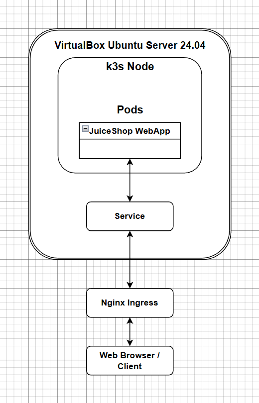
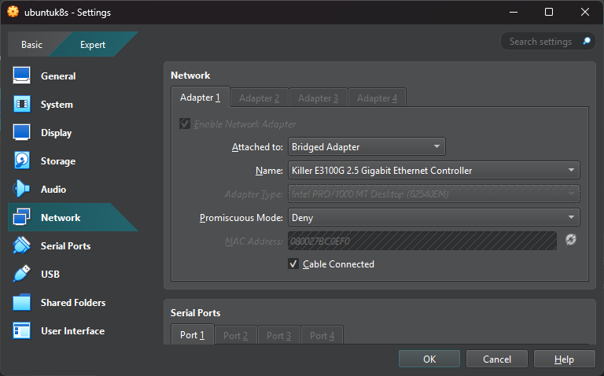
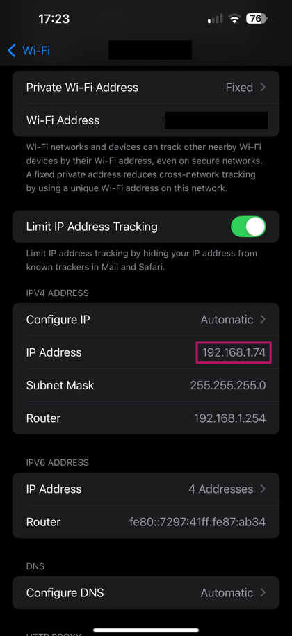

# Kubernetes WebApp Deployment with Nginx Ingress and IP Whitelisting (ZTNA)

## Project Overview
This project demonstrates Zero Trust Network Access principles by deploying a vulnerable web application *(OWASP Juice Shop)* on Kubernetes and enforcing IP Whitelisting using the Nginx Ingress Controller.

The environment was set up in a dedicated VM to ensure stable, production-like network policy enforcement, avoiding common pitfalls found in virtual environments like WSL2.

### Stack Used
* **Operating System:** Ubuntu Server 24.04 LTS *(inside VirtualBox)*
* **Networking:** Bridged Adapter *(we're using LAN connectivity)*
* **Container Orchestration:** K3s *(lightweight Kubernetes distribution)*
* **Security:** Nginx Ingress Controller *(for IP Whitelisting)*
* **Target:** OWASP Juice Shop

### Data Flow
The flow chart below illustrates the controlled path of data, ensuring only whitelisted devices are permitted to interact with the application.

---

## Part 1: Environment Setup

### 1. Dedicated VM and Networking
An Ubuntu Server 24.04 LTS instance was installed in VirtualBox using a Bridged Adapter networking setup. This configuration was crucial to ensure the VM received its own unique IP address on the Local Area Network, enabling accurate IP-based policy enforcement.

### 2. Remote Access
After configuring the server, SSH access was established from the Windows host using WSL2, allowing for efficient command-line management and file transfers.

### 3. Kubernetes Cluster Deployment
I chose k3s for its lightweight nature and simplicity. The cluster was installed with the default Traefik Ingress controller disabled to prevent conflicts with the Nginx Ingress controller, which was installed separately to manage traffic rules.

---

## Part 2: Deployment and Policy Enforcement

### 1. Web App Deployment & Whitelisting Policy
The deployment utilises a single YAML file containing the web app deployment, a service to expose it internally, and the Nginx Ingress Policy. This policy explicitly defines an IP Whitelist using annotations. In this demonstration, my mobile phones IP address *(`.74`)* was whitelisted, ensuring all other addresses are implicitly denied.

The key policy annotations included in the Ingress manifest:

### 2. Application and Verification
The configuration file was transferred to the server via PowerShell's `scp` command and then applied using `kubectl apply`. 

 

### 3. Access Testing and Policy Validation
To observe policy enforcement in real-time, the logs of the Nginx Ingress controller were streamed using the `-f` flag. 

|Device | Source IP | Policy Outcome | Log Evidence
| :--- | :--- | :--- | :--- |
|Windows PC|192.168.1.102|DENY|The PC's IP, which was not whitelisted, was successfully blocked.
|iPhone|192.168.1.74|ALLOW|The whitelisted connection was granted access.

The policy was successfully verified by accessing the web app from the whitelisted iPhone: 

Connection via the browser on mobile:

The LAN IP given to the iPhone matches the one in the whitelisted deployment YAML:

## Troubleshooting and Notes
### WSL2, MicroK8s and Docker Limitations
During the initial setup, using WSL2 with MicroK8s and Docker caused major networking issues. Initially, I attempted to deploy the Kubernetes cluster inside WSL2 using MicroK8s. While MicroK8s installs quickly and runs well in most environments, WSL2 introduces several complications:

⦁	MicroK8s runs a virtual network internally, and exposing NodePorts or accessing Ingress from the host machine required complex port forwarding. Even using `netsh interface portproxy` on Windows did not reliably allow external devices to reach the services.

⦁	MicroK8s’ logs for the Nginx Ingress controller are scattered across Snap-managed directories. Attempting to kubectl logs sometimes hangs, especially when running as a non-root user. Purging MicroK8s occasionally left orphaned configurations or Snap artifacts, which broke subsequent cluster deployments or service discovery.

### Calico Observations
As part of earlier experimentation *(documented in the “ZTNA Calico Project")*, I tested Calico for network policies. 

Calico allowed cleaner log streaming from pods and network policies - `kubectl logs -n kube-system calico-node-*` - and provided visibility into allowed/denied traffic.

However, Advanced CRD-based policies in Calico introduced complexity, and querying their logs required joining multiple resources *(e.g. NetworkPolicy, GlobalNetworkPolicy)* which made it much harder to present clean, reproducible evidence in documentation. 

Furthermore, debugging ingress traffic with IP whitelists was not straightforward due to policy propagation delays and lack of clear error logs from Nginx Ingress about blocked IPs.

### Lessons Learned

⦁	Early experimentation with Calico informed later design choices: in production-like setups, keeping the cluster simple and reproducible is more effective than pursuing advanced CRD-based policies in constrained environments.

⦁	Running Kubernetes in a dedicated VM *(Ubuntu Server in VirtualBox)* provides a much more stable networking environment than WSL2.

⦁	Using k3s as the lightweight Kubernetes distribution avoids Snap-related issues while still providing full Ingress controller support.

⦁	Always verify Ingress endpoints and service connectivity after cluster changes to avoid 502/503 errors.

⦁	Direct pod log streaming in the correct namespace ensures consistent visibility of allowed and denied connections.

⦁	Log streaming should be done directly from running pods in their correct namespace, ensuring consistent visibility into allowed/denied connections.

## Server Journal and Set-Up
The full process for reproducing this project are as follows:

**Ubuntu image:** https://ubuntu.com/download/server

**VirtualBox hostname:** ubuntu-k8s **Type:** Linux Version: Ubuntu *(64-bit)*

**Networking:** Bridged Adapter *(So the VM gets an IP from the LAN)*

*Settings > Storage > Attach the downloaded .iso*

**Check if SSH is enabled:**
`systemctl status ssh`
WSL2 Windows> `ssh youcef@192.168.1.112`

**Install k3s without the Traefik ingress controller:**
`curl -sfL https://get.k3s.io | INSTALL_K3S_EXEC="--disable traefik" sh -`
`sudo kubectl get nodes`

**Install the Nginx Ingress Controller:**
`sudo kubectl apply -f https://raw.githubusercontent.com/kubernetes/ingress-nginx/main/deploy/static/provider/cloud/deploy.yaml`
`sudo kubectl get pods -n ingress-nginx` *(Should show pods as running after a minute)*

**Transfer the web app deployment from Windows to the VM:**
*PowerShell>* `scp C:\Users\XXX\juice-shop.yaml youcef@192.168.1.112:/home/XX`
*PowerShell>* *(Enter the password for the VM)*

**Deploy the web server with the ingress rules:**
`sudo kubectl apply -f /home/XX/juice-shop.yaml`

**Find the VM IP to connect on a device:**
`ip a` *(Look for something like 192.168.1.XX)*

**Access the Web App:**
*http://192.168.1.XX*

**Check resources:**
`kubectl get nodes`
`kubectl get pods -A`
`kubectl get svc`
`kubectl get ingress`
`kubectl get pods -n ingress-nginx`

**Stream logs:**
`kubectl logs -n ingress-nginx -f ingress-nginx-controller-7dfff6b6ff-pd4hc` *(Replace with the name of the actual ingress controller from `get pods`)*
